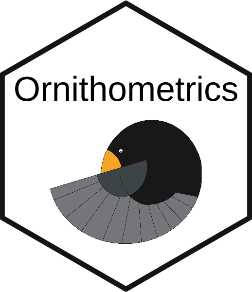

# Ornithometrics (ctv) R Task View <a href='https://github.com/beausoleilmo/Ornithometrics-ctv'></a>

The Comprehensive R Archive Network (CRAN)'s [website](https://cran.r-project.org/web/views/) provides *task views* for a variety of topics, guiding the users to a diversity of packages that could be useful to that topic. Here we provide a collection of relevant packages in ornithology that covers a wide variety of topics in avian studies. 

A package is missing? Please, feel free to get in touch and share your ideas! 

```
# Install and load libraries ----------------------------------------------------------
install.packages("ctv")
library(ctv)

# Download the CTV to a know location -------------------------------------

# Here the ".ctv" is in "scripts"
ornitho.metric.ctv <- read.ctv("scripts/Ornithometrics.ctv")

# Use the install.packages() function to install the packages
install.packages(ornitho.metric.ctv$packagelist$name)
```