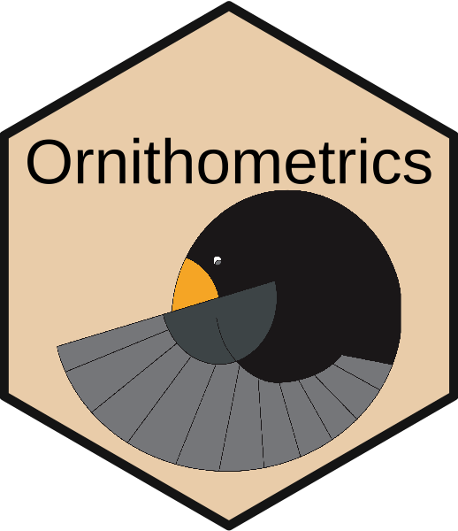

# Ornithometrics (ctv) R Task View 

The Comprehensive R Archive Network (CRAN)'s [website](https://cran.r-project.org/web/views/) provides *task views* for a variety of topics, guiding the users to a diversity of packages that could be useful to that topic. Here we provide a collection of relevant packages in ornithology that covers a wide variety of topics in avian studies. 